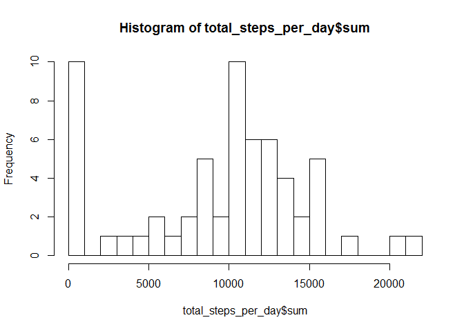
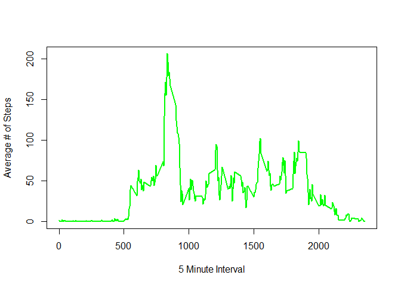
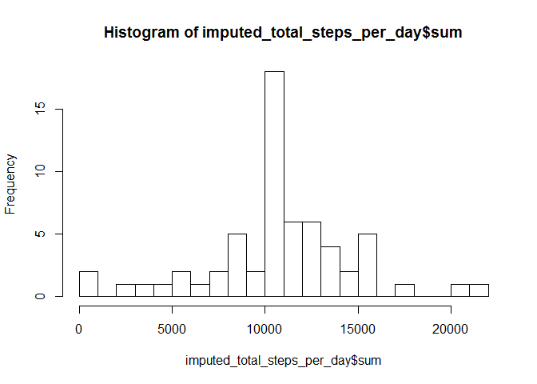

# Reproducible Research: Peer Assessment 1
Mark Stevenson  
Sunday, October 18, 2015  


## Loading and preprocessing the data


Ensure required libraries are installed and loaded:


```r
# install.packages('plyr')
# install.packages('dplyr')
# install.packages('timeDate')
# install.packages('lattice')
# install.packages('ggplot2')

library(plyr)
library(dplyr)
library(timeDate)
library(lattice)
library(ggplot2)
```

Set working directory and load data:


```r
setwd("C:/Users/mastevenson/Desktop/RepData_PeerAssessment1")

data<-read.csv('activity.csv')
```

## What is mean total number of steps taken per day?

**Calculate the total number of steps taken per day**

*Author's Note: There are 61 totals days and to save space (instead of printing all rows via Knitr) we're only going to show the first few rows via the head() command*


```r
total_steps_per_day<-ddply(data,~date,summarise,sum=sum(steps,na.rm=TRUE))
head(total_steps_per_day)
```

```
##         date   sum
## 1 2012-10-01     0
## 2 2012-10-02   126
## 3 2012-10-03 11352
## 4 2012-10-04 12116
## 5 2012-10-05 13294
## 6 2012-10-06 15420
```

**If you do not understand the difference between a histogram and a barplot, research the difference between them. Make a histogram of the total number of steps taken each day**


```r
hist(total_steps_per_day$sum, breaks=30)
```

 

**Calculate and report the mean and median of the total number of steps taken per day**

*Author's Note: As the directions state 'For this part of the assignment, you can ignore the missing values in the dataset' we will set na.rm to TRUE.*

Please see mean and median calculations:


```r
mean(total_steps_per_day$sum,na.rm=TRUE)
```

```
## [1] 9354.23
```

```r
median(total_steps_per_day$sum,na.rm=TRUE)
```

```
## [1] 10395
```

## What is the average daily activity pattern?

**Make a time series plot (i.e. type = "l") of the 5-minute interval (x-axis) and the average number of steps taken, averaged across all days (y-axis)**


```r
Average_Steps_by_Interval<-ddply(data,~interval,summarise,mean_value=mean(steps,na.rm=TRUE))

plot(Average_Steps_by_Interval$interval, Average_Steps_by_Interval$mean_value, type="l", xlab= "5 Minute Interval", ylab= "Average # of Steps", col="green" , lwd=2)
```

 

**Which 5-minute interval, on average across all the days in the dataset, contains the maximum number of steps?**


```r
max_interval<-Average_Steps_by_Interval[order(Average_Steps_by_Interval$mean_value),]
tail(max_interval,1)
```

```
##     interval mean_value
## 104      835   206.1698
```

Interval 835 has maximum average of 206 steps

*Author's Note: It appears this is the 8:35AM (morning) interval and as such would make sense with activities during this time such as a commute on foot in a city to work.* 

## Imputing missing values

Note that there are a number of days/intervals where there are missing values (coded as NA). The presence of missing days may introduce bias into some calculations or summaries of the data.

**Calculate and report the total number of missing values in the dataset (i.e. the total number of rows with NAs)**


```r
length(which(is.na(data)))
```

```
## [1] 2304
```

2304 missing values

**Devise a strategy for filling in all of the missing values in the dataset. The strategy does not need to be sophisticated. For example, you could use the mean/median for that day, or the mean for that 5-minute interval, etc.**

*Author's Note: From the above operation I will leverage the average value of each 5 minute interval across the 61 days and and on specific days with missing values I will replace the NA's with the average value for the associated time interval*

*First identify the days which are NA and place in separate table. Please see additional comments in code below.*


```r
missing_days <- subset(data, is.na(data$steps))

## Remove them from the master data set
complete_data<-data[complete.cases(data),]

## Perform a left relational join with the missing data set to the average interval data set on the interval value
## Author's Comment: For your edification, if you are unsure of this,  please Google for 'SQL Left Join'
joined_data <- left_join(missing_days, Average_Steps_by_Interval, by='interval')

## Add the new averages back in
drops <- c("steps")
joined_data<-joined_data[,!(names(joined_data) %in% drops)]
```

**Create a new dataset that is equal to the original dataset but with the missing data filled in.**


```r
## Merge new imputed data into parent data set
colnames(joined_data)[3] <- "steps"
imputed_data<-rbind(complete_data,joined_data)
```

**Make a histogram of the total number of steps taken each day and Calculate and report the mean and median total number of steps taken per day.** 


```r
imputed_total_steps_per_day<-ddply(imputed_data,~date,summarise,sum=sum(steps))

hist(imputed_total_steps_per_day$sum, breaks=30)
```

 

```r
mean(imputed_total_steps_per_day$sum)
```

```
## [1] 10766.19
```

```r
median(imputed_total_steps_per_day$sum)
```

```
## [1] 10766.19
```

The mean value is 10766 and the median is 10766.

**Do these values differ from the estimates from the first part of the assignment? What is the impact of imputing missing data on the estimates of the total daily number of steps?**

*Author's Note: The original mean and median were 9354.23 and 10395 (w/NA's removed), respectively. Imputing the missing data results in increasing the mean and median values.* 

## Are there differences in activity patterns between weekdays and weekends?

For this part the weekdays() function may be of some help here. Use the dataset with the filled-in missing values for this part.

**Create a new factor variable in the dataset with two levels - "weekday" and "weekend" indicating whether a given date is a weekday or weekend day.**


```r
imputed_data$day_type<-ifelse(isWeekday(imputed_data$date),'Weekday','Weekend');
imputed_data$day_type <- as.factor(imputed_data$day_type)
```

**Make a panel plot containing a time series plot (i.e. type = "l") of the 5-minute interval (x-axis) and the average number of steps taken, averaged across all weekday days or weekend days (y-axis). See the README file in the GitHub repository to see an example of what this plot should look like using simulated data.**


```r
imputed_average_data <- aggregate(steps ~ interval + day_type, data = imputed_data, mean)

# Quick dummy check (24 hours * 60 minutes) = 1440 minutes in one day
# 1440 total daily minutes divided by 5 minute intervals produces 288 intervals
# Bifurcated by weekend and weekday provides 288 * 2 = 576 total five minutes windows 

xyplot(steps ~ interval|factor(day_type),
       data = imputed_average_data,
       type = "l",
       xlab = "Interval",
       ylab = "Number of steps",
       layout=c(1,2))
```

 

*Author's Note: You can clearly see on the weekday plot there is more activity in the mornings and less throughout the day. The Author's hypothesis is this is attributable to the workday and that the individual may be sitting at a desk or be more sedentary. Additionally on the weekends we can observe more activity throughout the day.*  
